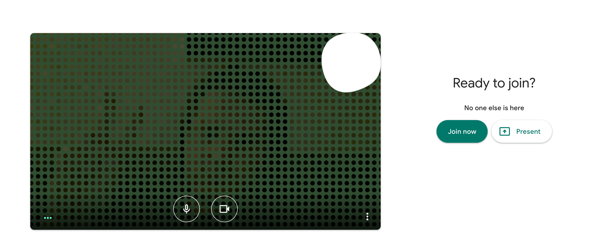

# Canvas Virtual Camera

Canvas virtual camera is a virtual camera, that is canvas. This means you can write to the canvas like you would normally do and also stream the canvas output to a media device. The camera injects a media device into the the browser see [spite/virtual-webcam](https://github.com/spite/virtual-webcam) for a more light weight implementation of virtual webcams.

To use this you will need to build the Chrome extension and install it locally. Will be looking to publish one people can use from the store in the future...

## Installing

Clone and install the dependencies, I use yarn for this.

```shell
yarn
```

Then install the [Chrome Extension](chrome://extensions) from unpacked on the extensions page. The unpacked directory is **./build**.

Start up Google Meet\* and select the **Canvas Camera** camera.

> Only Google Meet is supported right now.

## Developing

The canvas code is in the [stream to canvas components](./src/components/stream-to-canvas/index).


